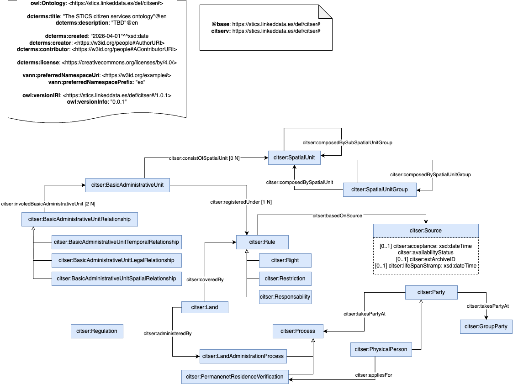

# Citizens services Ontology

The STICS Citizens Services ontology describes the domain of citizens and local services.

# Purpose and scope of the vocabulary

The purpose of the STICS Citizens Services ontology is to represent knowledge about agents as citizens or organizations and the information related to services offered to citizens.

The scope of the STICS Citizens Services ontology ontology is limited to the use of citizens' data in relation with lot ownerships, permanent residence and  municipality agendas.

# Ontology prefix and namespace

The STICS Citizens Services ontology prefix is: citser and it is published under the namespace: https://stics.linkeddata.es/def/citser# 

# Ontology Conceptualization Image

Every ontology development repository should include, in this root README, a visual representation of the ontology conceptualization.
This image helps users and contributors quickly understand the ontology’s structure, key concepts, and relationships.
- The image should be located in the conceptualization folder.
- Accepted formats: .svg, .png, or .drawio.
- It should be referenced in this README using Markdown syntax, for example:

# Reposity structure

The repository should contain (at least) the following folders:

| Folder | Description |
|--------|--------------|
| **diagrams/** | Stores diagrams and other resources representing the conceptual model of the ontology (e.g., class hierarchies, relationships). |
| **documentation/** | Stores the HTML or human oriented documentation of the ontology and related artefacts. |
| **examples/** | Includes examples that demonstrate how to instantiate or apply the ontology in real data scenarios. |
| **kos/** | Stores controlled vocabularies or KOS implementation, usually SKOS implementations in rdf. |
| **ontology/** | Contains the actual ontology implementation files in formats such as `.owl`, `.rdf`, `.ttl`, or `.jsonld`. |
| **requirements/** | Contains all documents used to define the ontology’s requirements: data example, competency questions, functional requirements, use cases, etc. |
| **shapes/** | Contains the SHACL shapes used to define and validate ontology constraints. |

# Project maintenance

To manage those incidents or suggested improvements with respect to the vocabulary, we recommend you to follow
the guides provided in [Issues Management](https://github.com/nombre-repositorio/wiki/issues-management) to
generate an issue (work in progress)

# Funding

Add here project funding and needed images.
